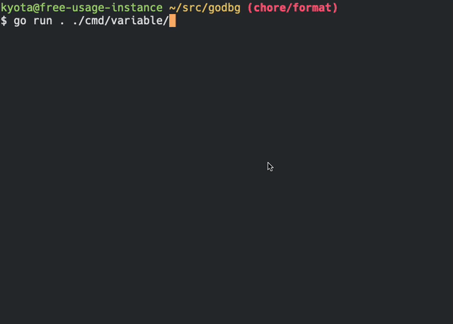

# godbg
godbg is a simple Go debugger. 

godbg supports only Linux amd64.



# How to use

## Run Debugger

```bash
cd path/to/godbg

go run . ./cmd/variable # you can execute arbitary go program
```

## Debugger commands

godbg supports following commands.

- continue
- break
- stepin
- next
- stepout
- backtrace
- variables

### examples

```
godbg> break main.main

godbg> continue
  1 package main
  2
  3 import "fmt"
  4
> 5 func main() {
  6 	foo := -3
  7 	bar := 2
  8 	baz := foo + bar
  9
  10 	foo = 4

godbg> next
  1 package main
  2
  3 import "fmt"
  4
  5 func main() {
> 6 	foo := -3
  7 	bar := 2
  8 	baz := foo + bar
  9
  10 	foo = 4
  11

godbg> next
  2
  3 import "fmt"
  4
  5 func main() {
  6 	foo := -3
> 7 	bar := 2
  8 	baz := foo + bar
  9
  10 	foo = 4
  11
  12 	fmt.Printf("foo: %d, bar: %d, baz: %d\n", foo, bar, baz)

godbg> next
  3 import "fmt"
  4
  5 func main() {
  6 	foo := -3
  7 	bar := 2
> 8 	baz := foo + bar
  9
  10 	foo = 4
  11
  12 	fmt.Printf("foo: %d, bar: %d, baz: %d\n", foo, bar, baz)
  13 }

godbg> next
  5 func main() {
  6 	foo := -3
  7 	bar := 2
  8 	baz := foo + bar
  9
> 10 	foo = 4
  11
  12 	fmt.Printf("foo: %d, bar: %d, baz: %d\n", foo, bar, baz)
  13 }

godbg> variables
variable bar: 2
variable baz: -1
variable foo: -3

godbg> continue
foo: 4, bar: 2, baz: -1
```

# Reference
- [Delve](https://github.com/go-delve/delve)
- [Writing a Linux Debugger](https://blog.tartanllama.xyz/writing-a-linux-debugger-setup/)